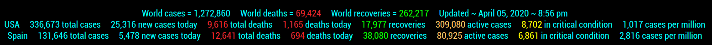

## MMM-CoronaVirus

* A lite version. Simply stats.
* Top line = world total stats
* Middle line = User chooses a country that is always displayed
* Bottom line = A rotation of all countries

* Alternately, you can show just one, any two, or all three lines by simple css rule

## Examples



* Click image above for life-size view

## Installation

* `git clone https://github.com/mykle1/MMM-CoronaVirus` into the `~/MagicMirror/modules` directory.

* Annotated .css file included for your convenience.

## Config.js entry and options
```
{
disabled: false,
module: 'MMM-CoronaVirus',
position: 'bottom bar',
config: {
  country: "USA", // Choose a country to always be shown
  totalCasesColor: "#ffc564", // hex color codes
  deathsColor: "#ed282f",
  newCasesColor: "#ffff00",
  recoveryColor: "#62FF00",
  criticalColor: "#ffff00",
  activeColor: "#ffc564",
  useHeader: false,   // False if you don't want a header
  header: "",         // Any text you want. useHeader must be true
  animationSpeed: 0,  // fade speed
  rotateInterval: 30 * 1000, // switch to next country in rotation
    }
},
```

## Special thanks to cowboysdude for continuous support and wizardry
